# Customer Order Management System

A line-of-business application for managing customers, products, orders,
invoices and payments: the kind of internal operations software found in
distribution, manufacturing, print, service and retail companies. A SQL
Server database sits at the centre, an ASP.NET Core web application serves
managers and staff, and a Windows Forms client on .NET Framework 4.8 serves
the back office. Both clients share one domain model and one data layer.

The project exists to demonstrate practical business application
development on the Microsoft stack, including the mixed-framework reality
of most established .NET shops.

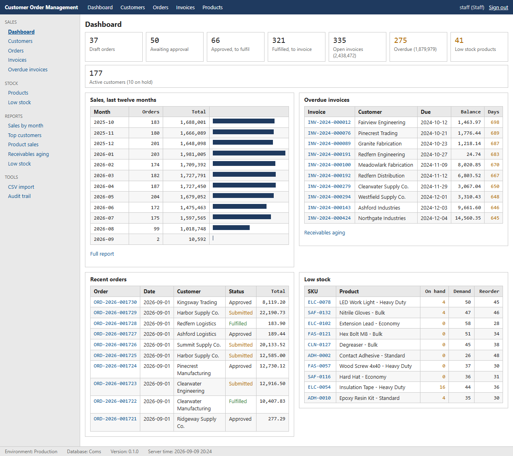

## What it does

- **Customers**: master data with billing and shipping addresses, payment
  terms, credit limit and status; account balance, statement, notes.
- **Products**: SKU, pricing, cost, unit of measure, stock on hand and
  reorder level; stock adjustments with a reason; low-stock reporting.
- **Orders**: draft, submit, approve (with credit check against outstanding
  invoices and committed orders), fulfil (moves stock), cancel; line
  snapshots of price and cost; full status history; printable confirmation
  and pick list.
- **Invoices and payments**: one live invoice per order, partial and full
  payments, void with re-invoice, receivables aging, customer statement.
- **Reports**: sales by month, top customers, product sales and margin,
  receivables aging, low stock; every report exports to CSV.
- **CSV import** of customers and products with per-row validation and
  all-or-nothing commit; CSV export of every list.
- **Users and roles**: Administrator, Staff, Read only; audit trail of
  every status change.

## Stack

| Layer          | Technology                                              | Target             |
| -------------- | ------------------------------------------------------- | ------------------ |
| Database       | SQL Server 2022 / LocalDB, versioned T-SQL scripts (DbUp) | T-SQL            |
| Domain         | C# class library                                        | .NET Standard 2.0  |
| Data access    | Dapper + Microsoft.Data.SqlClient                       | .NET Standard 2.0  |
| Application    | Services, workflow, CSV import/export                   | .NET Standard 2.0  |
| Web            | ASP.NET Core MVC, ASP.NET Core Identity                 | .NET 10            |
| Desktop        | Windows Forms                                           | .NET Framework 4.8 |
| Tests          | xUnit: 297 tests at unit, database and HTTP level       | .NET 10            |
| CI             | GitHub Actions: build, tests, SQL migrations in a container | |

## Screenshots

Web application (staff user):

| | |
| --- | --- |
| 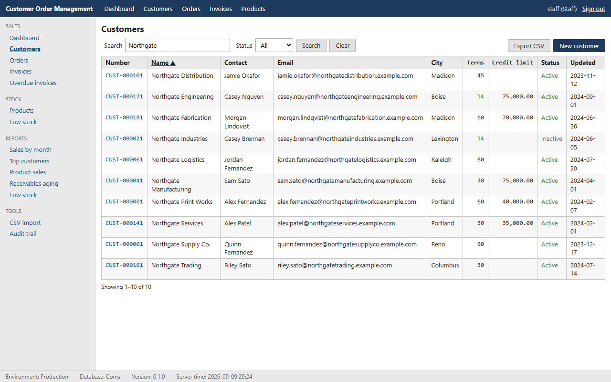 Customer list with filters and sorting | 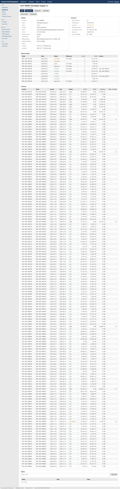 Customer detail: balance, orders, invoices, notes |
| 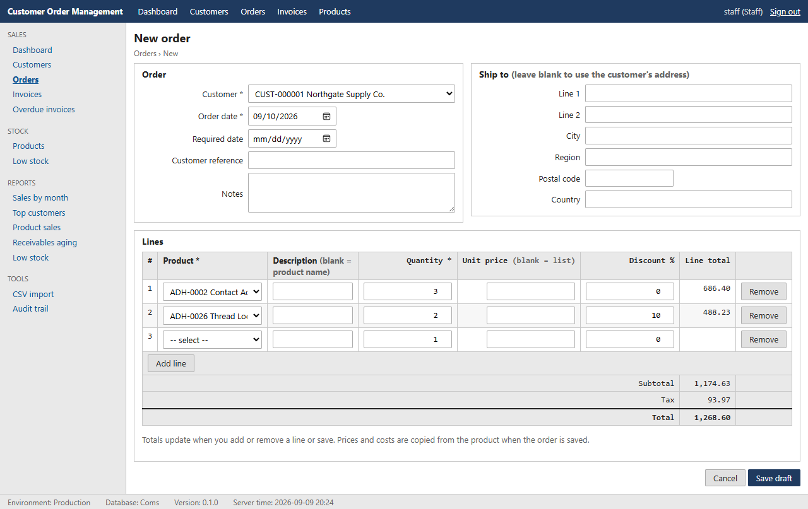 Order entry with live totals, no client script | 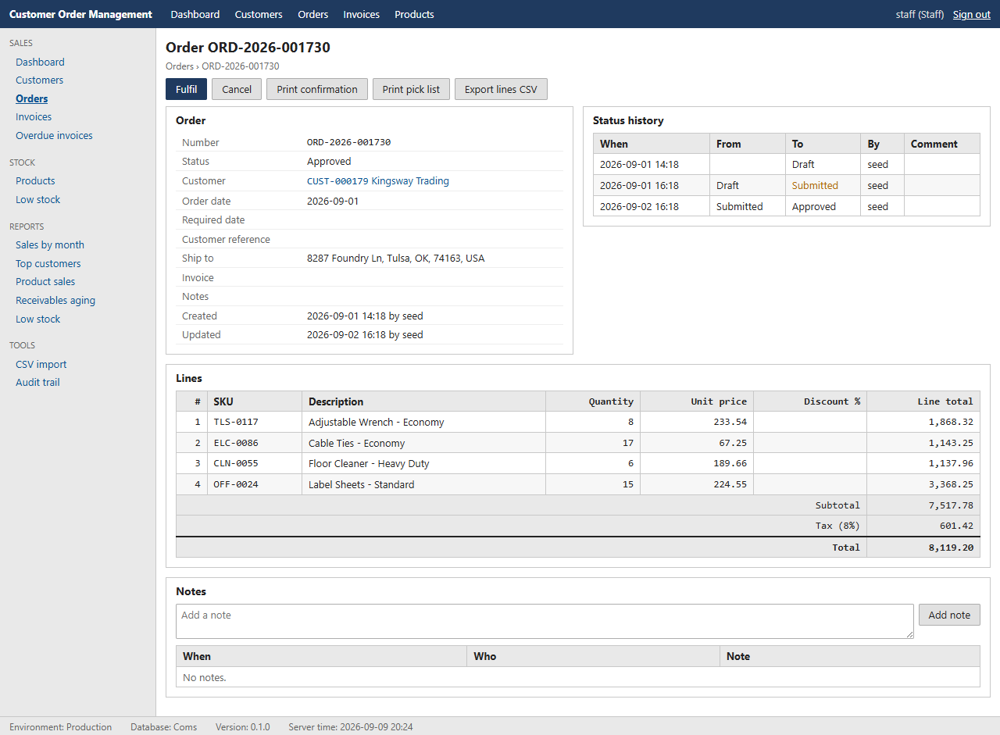 Order detail with history and workflow actions |
| 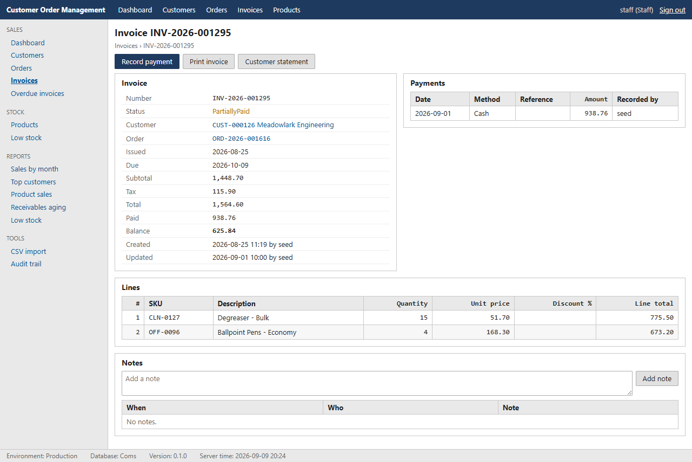 Invoice with payments | 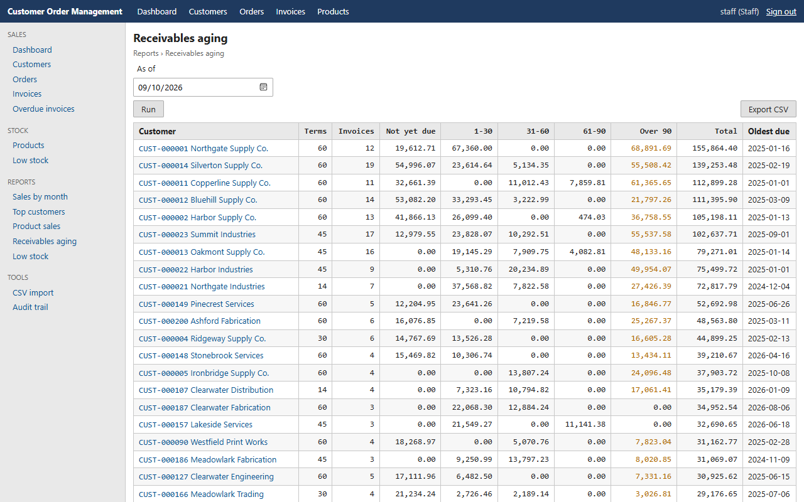 Receivables aging report |
| 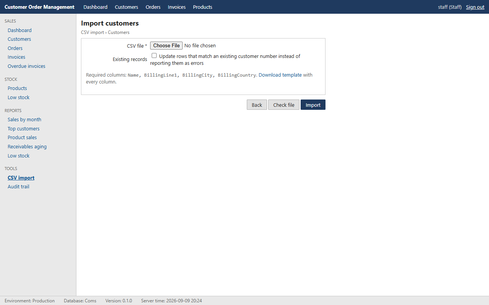 CSV import with row-level checking | 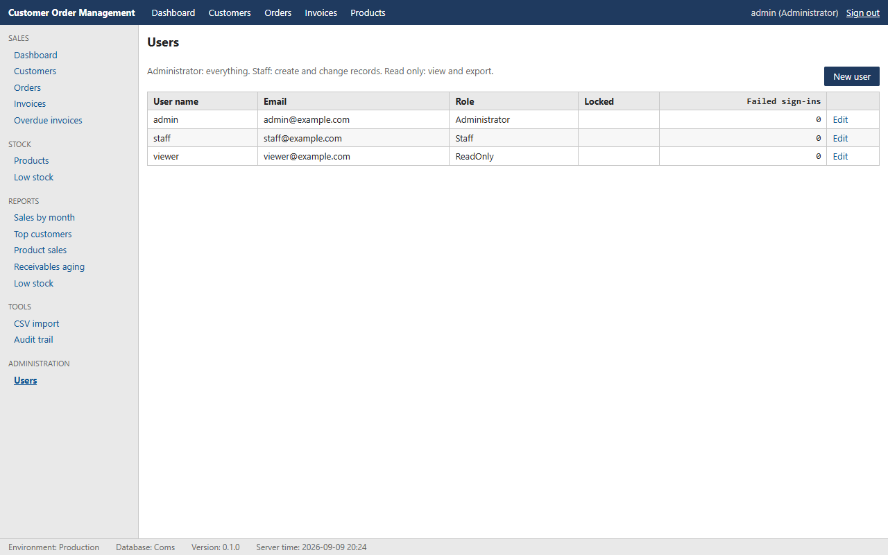 User administration |

Desktop client (.NET Framework 4.8):

| | |
| --- | --- |
| 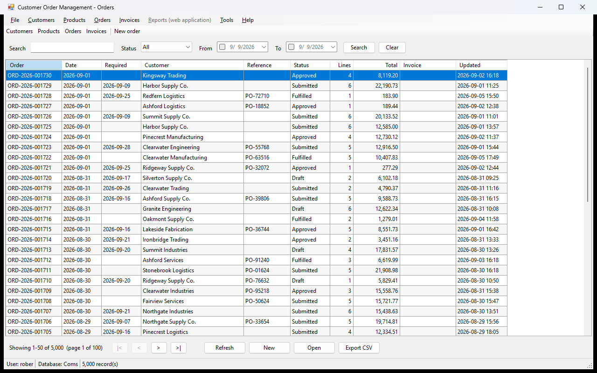 Order list | 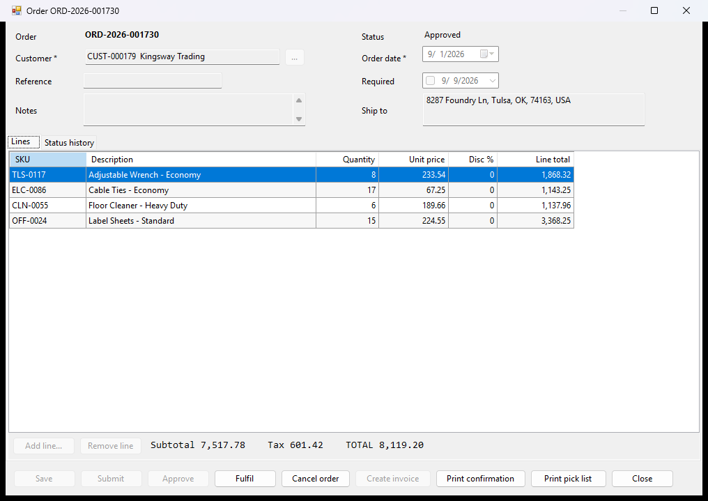 Order entry with editable lines |
| 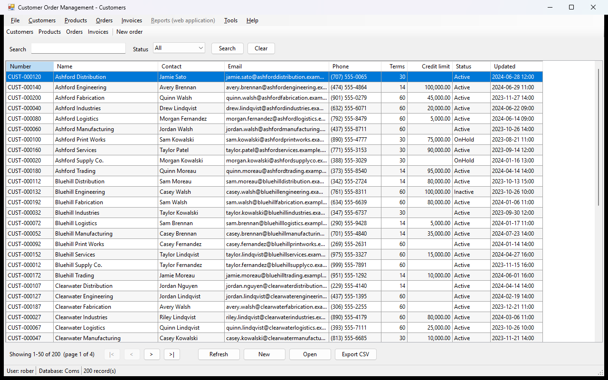 Customer list | 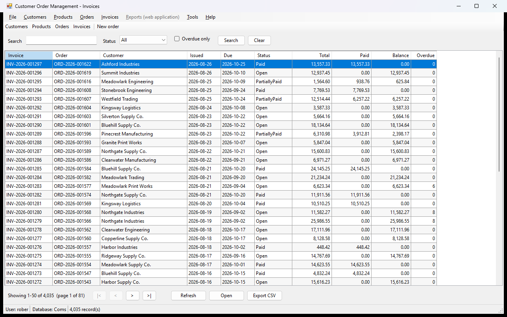 Invoice list |

More in [docs/screenshots](docs/screenshots).

## Quick start

Prerequisites: .NET 10 SDK, SQL Server Express LocalDB (or any SQL Server),
and Visual Studio 2026 with the .NET desktop workload if you want to run
the Windows client.

```
dotnet run --project tools/Coms.DbMigrator -- --seed
dotnet run --project src/Coms.Web
```

Open <https://localhost:7180> and sign in as `staff` / `Staff#2026`
(also `admin` / `Admin#2026` and `viewer` / `Viewer#2026`). The seed loads
two years of realistic history: 200 customers, 150 products, 5,000 orders.

Desktop client:

```
dotnet build src/Coms.Desktop
src\Coms.Desktop\bin\Debug\net48\Coms.Desktop.exe
```

Tests:

```
dotnet test CustomerOrderManagement.sln
```

[docs/setup.md](docs/setup.md) has configuration, a full command reference
and troubleshooting.

## Repository layout

```
src/
  Coms.Domain/          Entities, validation, state machine, repository contracts
  Coms.Data/            Dapper repositories, unit of work, SQL
  Coms.Application/     Services: orders, invoicing, credit check, CSV
  Coms.Web/             ASP.NET Core MVC application
  Coms.Desktop/         WinForms client (.NET Framework 4.8)
tests/                  Domain, Application, Data and Web test projects
tools/Coms.DbMigrator/  Applies db/migrations and db/seed
db/
  migrations/           Numbered, forward-only T-SQL scripts
  seed/                 Deterministic demo data
  scripts/              Reports, workflow smoke test, index and plan reviews
docs/                   Architecture, database, setup, testing, UI style guide
```

## Documentation

- [Architecture](docs/architecture.md): the shape of the solution and the
  reasons behind the main decisions.
- [Database](docs/database.md): schema, numbering, procedures, error
  contract, reporting objects, indexes, performance notes.
- [Setup](docs/setup.md): prerequisites, configuration, commands,
  troubleshooting.
- [Testing](docs/testing.md): how the four test projects are organised
  and run.
- [UI style guide](docs/ui-style-guide.md): the deliberately plain,
  industrial interface conventions.

## Out of scope

Multi-currency, tax jurisdictions, multiple warehouses, purchasing and
suppliers, shipping carrier integration, email, PDF generation, mobile,
localisation, real-time updates, and a public API. The desktop client does
not authenticate separately; it records the Windows user name and is
intended for an internal network, as is common for back-office tools.

## License

MIT. See [LICENSE](LICENSE).
